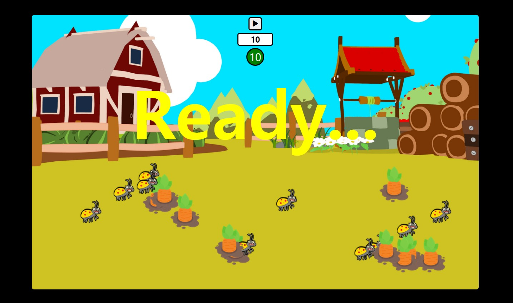
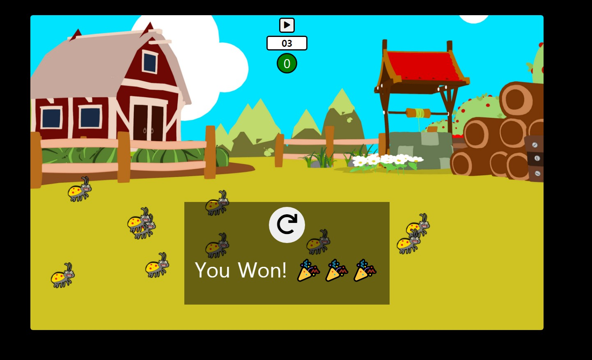
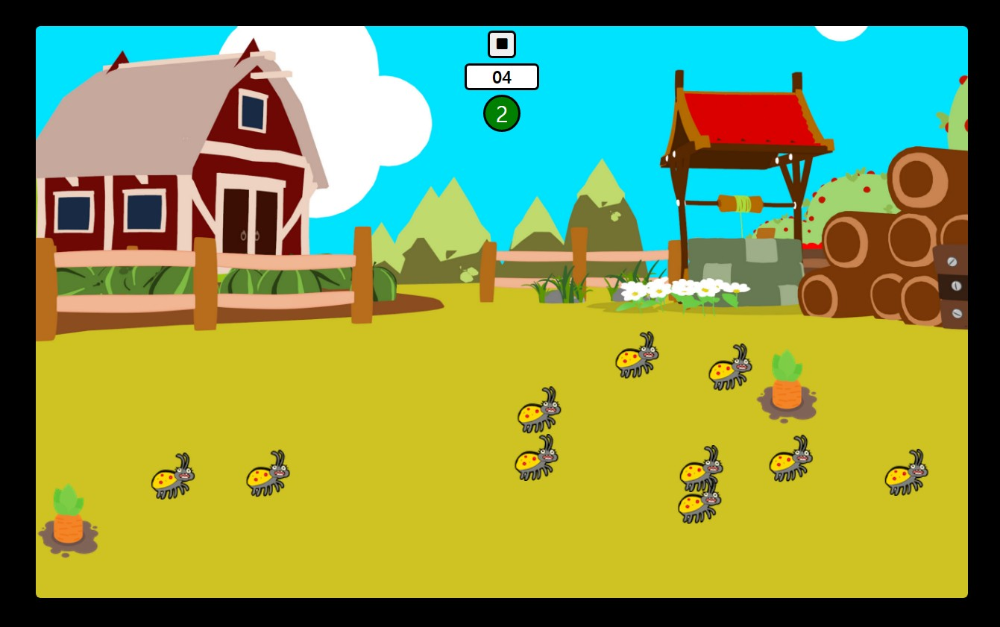

# CarrotAndBug

<ol>
  <li><strong>프로젝트 이름</strong> : Rabbit and Bug Game</li>
  <li><strong>사용 언어</strong> : HTML, CSS, vanila Javascript</li>
  <li><strong>주요 기능</strong> 
    <ul>
      <li><h5>타이머 및 플레이버튼</h5>화면 중앙 상단 10부터 시작하는 카운트 다운 타이머를 삽입하였습니다. 플레이 버튼을 누르면 작동하며, 다시 버튼을 누르면 일시 정지합니다.</li> 
      <li><h5>스코어보드</h5></li> 게임 화면 내 당근의 개수를 표시합니다
      <li><h5>당근과 벌레 랜덤 생성</h5></li> 랜덤한 위치에 당근 10개, 벌레 10마리를 생성합니다.
      <li><h5>게임 방식</h5></li> 당근 10개를 10초안에 전부 클릭해서 뽑아내면 승리하며, 벌레를 클릭하거나 카운트가 다되면 패배합니다.
      <li><h5>기타</h5></li> 당근 뽑는 소리, 벌레 클릭 소리 등 효과음과 배경음악을 삽입하였습니다. 
    </ul>
   </li> 
<ol>
  
  
  
  
  
